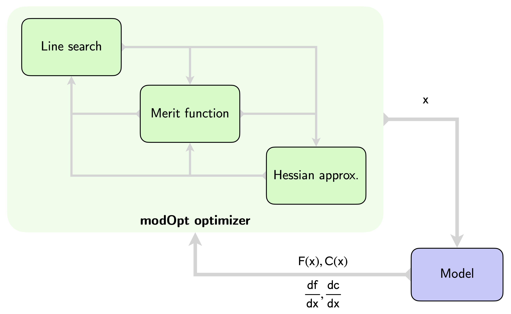

# Welcome to modOpt's documentation

modOpt is a modular development environment and library for optimization
algorithms, written in Python.
It is primarily designed to support research and education
in the field of numerical optimization.
modOpt facilitates rapid and efficient development of optimization algorithms 
by enabling a modular approach to building algorithms and 
providing built-in capabilities for testing and benchmarking.
<!-- testing and benchmarking leveraging 
built-in problems and interfaced test-suites. -->

<!-- By breaking down algorithms into self-contained modules--such as 
line searches and Hessian approximations—-modOpt allows optimization practitioners, 
students, and researchers to develop new or modified versions of existing algorithms 
by replacing or modifying these component modules.
Additionally, modOpt's benchmarking capabilities allow users to conveniently 
perform comparative studies of their algorithms against standard ones 
included in the library.
modOpt also includes built-in visualization and recording capabilities, and
interfaces to modeling frameworks such as JAX, CasADi, OpenMDAO and CSDL,
and various utilities for testing algorithms and postprocessing optimization results. -->

modOpt offers various features to support students, optimization practitioners, 
and advanced developers.
For instance, it includes built-in visualization and recording capabilities, 
interfaces to modeling frameworks such as JAX, CasADi, OpenMDAO and CSDL, and
an interface to the CUTEst test problem set.
It also provides several utilities for testing and benchmarking algorithms, 
and postprocessing optimization results.
modOpt is supported on Linux, macOS, and Windows.

modOpt allows users to define computational models specifying
the objective, constraints, and derivatives of optimization problems 
using one of the following six options:
1. The built-in `Problem` class,
2. The built-in `ProblemLite` class,
3. CSDL or CSDL_alpha,
4. OpenMDAO,
5. JAX, or
6. CasADi.

Once the model is defined, users can optimize it by selecting and running
an optimizer of their choice from the library of optimization algorithms 
available in modOpt.

## modOpt as a library of optimization algorithms

modOpt as a library includes several gradient-based and gradient-free optimization algorithms.
It provides interfaces to more than a dozen general-purpose optimizers, 
along with fully transparent implementations of several educational optimization algorithms.
The general-purpose optimizers available in modOpt include SLSQP, PySLSQP, OpenSQP,
SNOPT, IPOPT, Trust-Constr, BFGS, L-BFGS-B, Nelder-Mead, COBYLA, COBYQA, and CVXOPT.
The ConvexQPSolvers optimizer provides an interface to more than 15 QP solvers
available through the `qpsolvers` package.
Note that PySLSQP, SNOPT, IPOPT, COBYQA, CVXOPT, and qpsolvers must be 
installed separately if users wish to utilize them.
The modular and transparent educational algorithms in modOpt include
Steepest Descent, Quasi-Newton, Newton, Newton-Lagrange, Quadratic Penalty, 
SQP, InteriorPoint, PSO, Nelder-Mead Simplex, and Simulated Annealing.

<!--  -->
```{figure} /src/images/modopt_library.png
:figwidth: 100 %
:align: center
:alt: modopt_library

_**modOpt as a library**_
```

## modOpt as a development environment for optimization algorithms

modOpt's modular development environment facilitates the construction of 
optimization algorithms using self-contained modules.
When implementing new algorithms, developers can reuse stable and efficient modules 
already available in modOpt, eliminating the need to build these components from scratch. 
Similarly, existing algorithms in modOpt can be customized for specific applications
by modifying only the relevant modules.
Additionally, modOpt's benchmarking capabilities allow users to conveniently 
perform comparative studies of their algorithms against standard ones 
included in the library.
<!-- New optimization algorithms can be developed in a modular fashion 
by subclassing the `Optimizer` class in modOpt. -->
<!-- There are a number of transparent modules available within the package
which users can leverage to develop new or modified optimization algorithms. -->
<!-- Benchmarking against built-in standard algorithms or interfaced external optimizers
are also possible. -->

<!--  -->
<!--  -->
<!-- <p align="center"> -->
<!--  -->
<!-- </p> -->
```{figure} /src/images/modopt_env.png
:figwidth: 70 %
:align: center
:alt: modopt_lib

_**modOpt as a development environment**_
```

## Getting Started
To install and start using modOpt, please read the [Getting Started](src/getting_started.md) page.

## Citation
If you use modOpt in your work, please use the following reference for citation:

```bibtex
@article{joshy2024modopt,
  title={modOpt: A modular development environment and library for optimization algorithms},
  author={Joshy, Anugrah Jo and Hwang, John T},
  journal={arXiv preprint arXiv:2410.12942},
  year={2024},
  doi={10.48550/arXiv.2410.12942}
}
```

<!-- ## References

```{bibliography} src/references.bib
``` -->

```{toctree}
:maxdepth: 2
:caption: Contents

src/getting_started
src/modeling
src/optimization
src/postprocessing
src/optimizer_development
src/benchmarking
src/developer_docs
src/tutorials
src/examples
src/api
src/contributing
src/changelog
src/license
```

```{toctree}
:maxdepth: 2
:caption: Performant algorithms
:hidden:

src/performant_algs/slsqp
src/performant_algs/pyslsqp
src/performant_algs/cobyla
src/performant_algs/bfgs
src/performant_algs/lbfgsb
src/performant_algs/nelder_mead
src/performant_algs/cobyqa
src/performant_algs/trust_constr
src/performant_algs/opensqp
src/performant_algs/snopt
src/performant_algs/ipopt
src/performant_algs/qpsolvers
src/performant_algs/cvxopt
```

```{toctree}
:maxdepth: 2
:caption: Educational algorithms
:hidden:

src/educational_algs/steepest_descent
src/educational_algs/newton
src/educational_algs/quasi_newton

src/educational_algs/newton_lagrange
src/educational_algs/l2_penalty_eq

src/educational_algs/sqp
src/educational_algs/interior_point

src/educational_algs/nelder_mead_simplex
src/educational_algs/pso
src/educational_algs/simulated_annealing
```